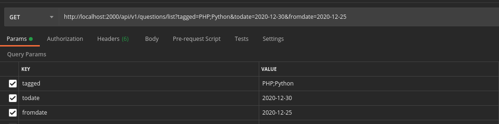

# STACKOVERFLOW QUESTIONS API

## BOOTSTRAPPING
The project is dockerized. For ease of use, a makefile has been created with different commands.

To start the project for the first time:

`make build`

`make start`

To enter the container we will use

`make ssh-be`

And there we will use `composer install` to install dependencies

You can create your own `.env` file
`.env.example` is a good template for this.

## USE
From Postman, we will access the path: http://localhost:2000/api/v1/questions/list using **GET** method

The following three parameters can be added:

- fromdate
- todate
- tagged

- The format of the dates must be: "Y-m-d"
- **Tagged is mandatory**, if we don't add at least one tag the system will show an exception.
- Multiple tags can be added by separating them with ";"

## FILES
The files used for this exercise are in the 'src/' folder 
except the QuestionsController.php that is used as the entry point to the application and Laravel's own routes file located in 'routes/api.php'

## TESTS
Only one test was written for this exercise. Located in the folder 'tests/Feature/RoutesTest.php'
This test makes sure that the route returns a code of 200.

For more information you can visit: https://api.stackexchange.com/docs/questions
